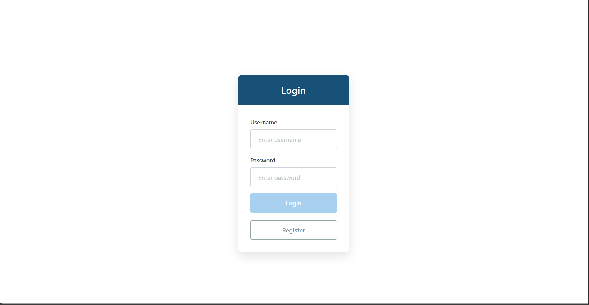
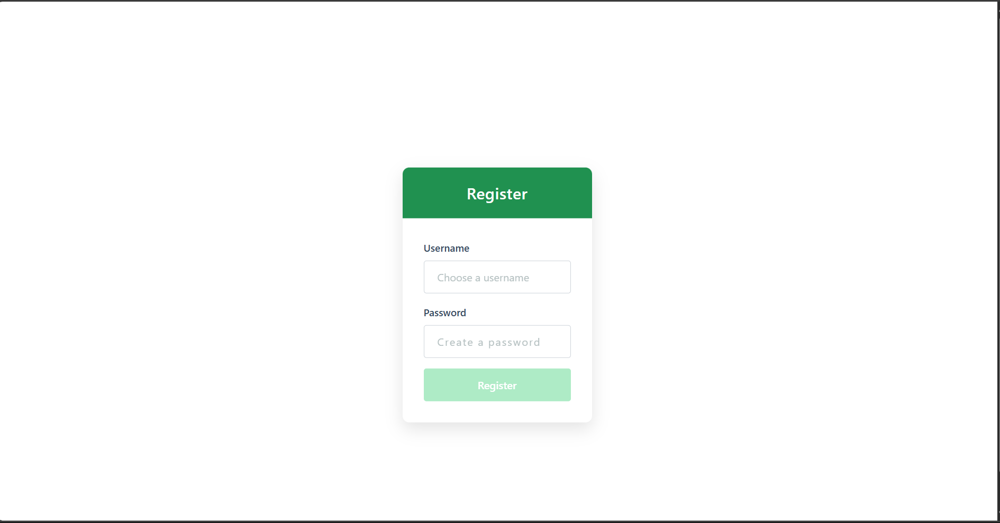
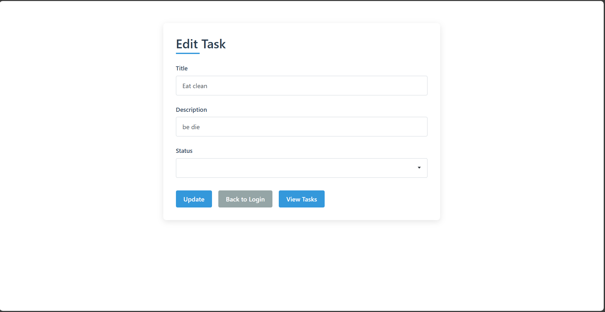
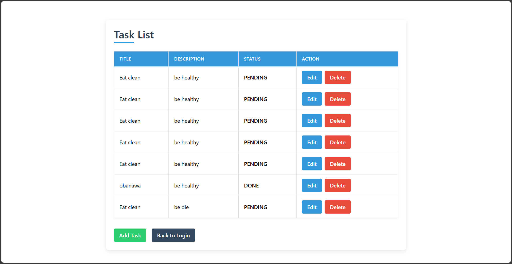

# ✅ Task Manager

A simple yet secure **Task Manager** application built with **Spring Boot (Java)** for the backend and **Angular** for the frontend. The app supports **JWT-based login and registration** and allows users to **create, view, update, and delete** tasks.

---

## 🚀 Features

- 🔐 JWT Authentication (Login & Register)
- 📋 Create, Read, Update, Delete (CRUD) for tasks
- 🧑‍💻 Secure endpoints for authenticated users
- ⚡ Fast and responsive Angular frontend
- 🧩 RESTful API with Spring Boot backend

---

## 🛠️ Tech Stack

### Frontend
- Angular
- TypeScript
- RxJS
- Bootstrap / Angular Material (if used)

### Backend
- Spring Boot
- Spring Security (with JWT)
- Spring Data JPA
- MySQL / H2 Database
- Maven

---
## 🔐 Login Page


## 🔐 Register Page


## 📋 Task Form


## 📋 Task list


## 📦 Installation

### 1. Clone the Repository
```bash
git clone https://github.com/KavinduSenesh/Task-Manager.git
cd Task-Manager
```
⚙️ Backend Setup (Spring Boot)
```
cd backend
````
Configure .properties or .yml with your DB and JWT secret:
```
spring.datasource.url=jdbc:mysql://localhost:3306/taskdb
spring.datasource.username=your_db_user
spring.datasource.password=your_db_password

jwt.secret=your_jwt_secret
```
Run the backend
```
./mvnw spring-boot:run
```
🌐 Frontend Setup (Angular)
Navigate to the Angular frontend folder
```
bash
Copy code
cd frontend
```
Install dependencies and run the app
```
bash
Copy code
npm install
ng serve

